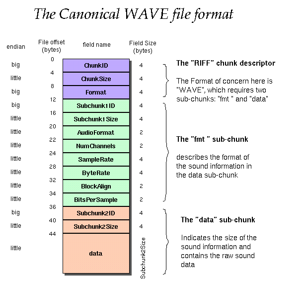
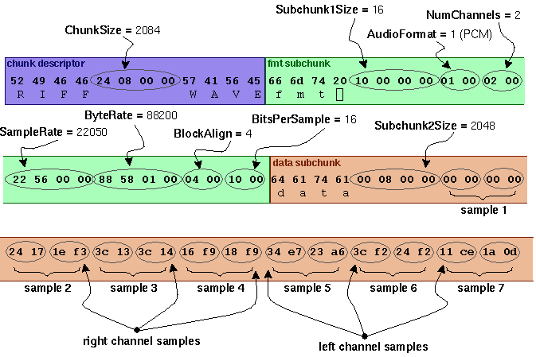

## WAV file format
WAV is a format used to store uncompressed audio data. It's an application of the Microsoft RIFF format.  
The diagrams below illustrate an example of a standard (canonical) WAV file.  

### RIFF and Chunks
Chunks are a property of the RIFF format developed by Microsoft. At the beginning of a WAV file, the first four bytes have "RIFF" in ASCII, and four bytes later is "WAVE", which signals the start of a WAV(E) chunk. The WAV file format specifies two necessary subchunks:  
- The FMT chunk, which starts with "fmt " (space at the end) and includes metadata about the audio such as the number of channels, sample rate, and bits per sample.  
- The data chunk, which starts with "data" and contains the raw audio data, stored as amplitude values of the sound wave.  
There may be more subchunks in a WAV file that may serve any purpose. The only rule is that in every subchunk, the first four bytes are an id (name) and the four bytes after the ID have the size as a little-endian integer. This allows a program to traverse the subchunks looking for FMT and data.  
### Audio Data
Audio data is encoded as a series of numbers (samples) that represent the amplitudes of a sound wave at different times. There is nothing in the data that says how fast the samples should be played; all information needed to interpret the samples, such as sample rate and number of channels, are stored in the FMT subchunk.  
A sample's length (in bits) can be any multiple of 8, but the only ones commonly used are 8, 16, 24, and 32. The higher the bits per sample, the higher the range of possible amplitudes.  
The concurrent samples for different channels are next to each other in order. For example, a stereo (2-channel) WAV file's data would be left sample 1, right sample 1, left sample 2, right sample 2, etc.  
## Our Project
### LSB mode
